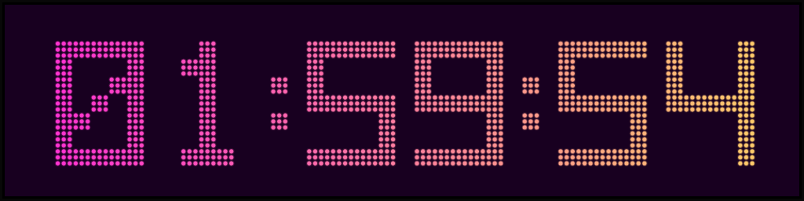
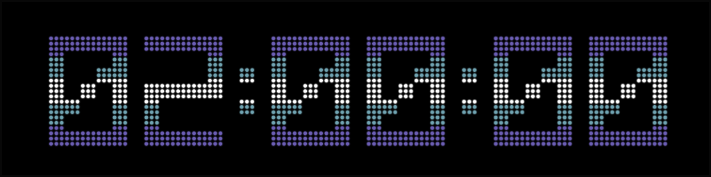
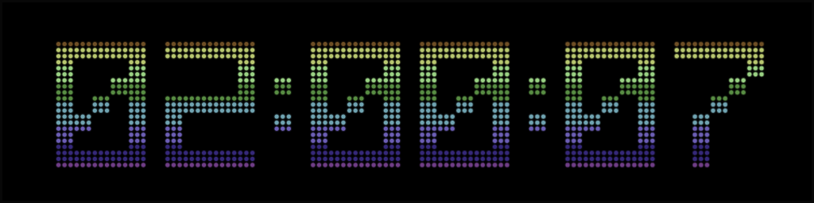

# DMDClock for Windows

DMDClock is a self-contained Windows x64 clock and animation player for classic DotClk `.scn` scenes. It recreates a 128×32, 4-bit monochrome dot-matrix display in a scalable Avalonia window, with clock overlays, scene metadata, automatic library updates and configurable playback.

The active project scope is the original single-color DMD format. Full-color Serum, cRom, larger displays and DMD Extensions integration are documented as future work.

## Screenshots

### Neon sunset



### C64 blue round raster



### C64 rainbow



## Current status

The Windows x64 application and screensaver are functional. The current implementation plays classic 128×32 four-bit SCN animations, watches the scene library for new files, renders configurable clocks and dates, supports bundled TTF/OTF fonts, and provides classic, gradient and static C64-inspired color themes. Serum, cRom, larger displays and DMD Extensions remain future work.

## Features

- Classic 128×32 orange, red, plasma or monochrome DMD appearance
- Five horizontal gradient themes and seven static C64-inspired raster themes
- DotClk `.scn` playback with storyboard timing, masks, blanking and clock layers
- Automatic clock/animation cycles with configurable duration, count and gaps
- Sequential or random playback
- 12-hour clock with AM/PM or 24-hour clock, with optional seconds
- ISO, European, US and dot-separated date formats
- Recursive `./scenes` library with incremental rescanning and file watching
- Optional `scene-metadata.json` for game, manufacturer and sequence information
- Five-second game/sequence overlay at animation start
- English menus by default, Swedish translation and a reusable i18n template
- Four-second Alien Tech startup branding with the actual number of loaded animations and project credit
- Keyboard shortcuts, fullscreen mode and a persistent right-click menu
- Window/fullscreen zoom from 5% to 5000% in 5% steps
- Optional title bar with click-and-drag movement in borderless mode
- Mouse pointer auto-hide after five seconds of inactivity over the display
- Native Windows x64 `.scr` package with fullscreen, configuration and Control Panel preview modes
- Structured UTF-8 logs with a 3 MiB rotation limit

## Running a published build

1. Open `DmdClock.App.exe` from the published `win-x64` directory.
2. Put `.scn` files in the `scenes` directory beside the executable.
3. Restart the app or choose **Rescan library (F5)**.

Scene files are intentionally not included in this repository. The application creates or uses `./scenes` by default, scans subdirectories recursively and preserves that directory across local builds.

ALTERN8, FISHY, TREK, and TWILIGHT are embedded clock fonts and can be selected
independently for time and date under **Appearance → Clock → Font** and
**Appearance → Date → Font**. All four support 12/24-hour time and every available
date format. The application supplies matching DMD separators where an original
font lacks `-`, `.`, or `/`.

Put optional `.ttf` or `.otf` files anywhere under the `fonts` directory beside the
executable. The font list is refreshed whenever the menu opens. Font choices and
user-added font files are preserved across local builds. The built-in 5×7 font
remains available as a fallback. The binary `.fnt` layout is documented in
[`docs/DOTCLK-FNT-FORMAT.md`](docs/DOTCLK-FNT-FORMAT.md).

The application remains functional without original DotClk resources: it starts with its built-in clock and waits for the user to select or add a scene library. Developers can download the original reference repositories and local test resources into the Git-ignored `external/` directory:

```powershell
./scripts/Get-OriginalResources.ps1
```

The command is safe to rerun and downloads only missing repositories. Use `-Update` to fast-forward existing clean repositories, `-Redownload` to obtain fresh copies, or `-Resource DotClk-Resources` to select a resource. See [`docs/SOURCES.md`](docs/SOURCES.md) for the official sources, safety behavior, and generated reproducibility metadata.

## Building from source

Requirements:

- Windows 10 or Windows 11 x64
- .NET 10 SDK
- PowerShell 7 recommended

```powershell
dotnet test DmdClock.sln -c Release
./scripts/Build.ps1
```

`Build.ps1` closes a running DMDClock instance, archives the previous published builds, publishes the regular self-contained Windows x64 build and a standalone single-file build, copies the local scene library into the regular build, generates compatibility/build reports and checksums, creates both portable ZIPs and starts the new regular executable. Use `-NoStart` when an automatic launch is not wanted.

Published files are written to:

```text
output/current/win-x64/
output/current/win-x64/DMDClock-win-x64-portable.zip
output/current/win-x64-standalone/
output/current/win-x64-standalone/DMDClock-win-x64-standalone.zip
```

The portable ZIP contains the complete self-contained application, `DMDClock.scr`, the bundled resources, compatibility/build reports and README. Extract the ZIP before running the application or installing the screensaver.

`SCN-COMPATIBILITY.txt` reports accepted, warned, and rejected file counts. Every warning or rejection includes the relative filename, a diagnostic code, and the reason. Invalid regular frame delays are reported as warnings and use the documented 100 ms playback fallback; damaged files and unsupported versions are rejected.

### Standalone Windows build

The standalone directory contains single-file `DmdClock.App.exe` and `DMDClock.scr` binaries with the .NET runtime, Avalonia, and native graphics libraries bundled. No adjacent runtime DLLs or installed .NET runtime are required. Native libraries are extracted automatically to the .NET temporary cache while the application runs.

Translations remain external under `i18n/`, and the redistributable Inter clock font remains under `fonts/`. Downloaded `.scn` animations are deliberately excluded; select an existing scene directory in the application or create a `scenes` directory beside the binaries. Keep `i18n` beside the binaries when distributing them. `SHA256SUMS.txt` contains verified hashes for both standalone binaries.

Assembly trimming remains disabled for the standalone build because Avalonia and related libraries use reflection. Trimming can be investigated separately after the untrimmed package is fully validated.

The 10 newest previous builds are retained under `output/archive/`; older archives are removed automatically after a successful build. Use `-MaxArchivedBuilds` to select another retention count.

The application and window icon use the selected single-flipper concept number 3. The multi-resolution Windows icon and its 512 px source are stored in [`assets/icons`](assets/icons).

Under **Appearance**, foreground and background colors can be selected with an RGB/hex color picker. Custom colors are saved in AppData; choosing one of the existing color themes resets the foreground to that theme while retaining the selected background.

Five multi-color DMD themes are included: Neon sunset, Cyber ocean, Toxic arcade, Vaporwave and Aurora. Each combines a horizontal two-color dot gradient, matching glow and a dark background while remaining compatible with the original four-bit DMD frames.

Seven static Commodore 64-inspired raster themes are also available: blue round raster, red round raster, earthtone raster, metal raster, interlaced blue, extruded cyan and C64 rainbow. They use continuous vertical color bands based on the classic fixed C64 palette without black separator lines. The experimental Secret Purple Mix is intentionally not included.

The mouse pointer automatically disappears after five seconds without movement while it is over the display. Moving the mouse makes it visible again immediately.

## Windows x64 screensaver

Every Windows x64 build includes `DMDClock.scr` beside `DmdClock.App.exe`. The standalone build provides the same pair without adjacent runtime DLLs. Both variants use the same selected scene directory, optional `fonts` directory, and preferences stored under `%LOCALAPPDATA%\DmdClock`.

To install it, right-click `DMDClock.scr` and choose **Install**, then select DMDClock in Windows Screen Saver Settings. Keep the complete published directory in place because the `.scr` file uses the self-contained runtime files beside it.

Standard Windows screensaver modes are supported:

- `DMDClock.scr /s` – fullscreen screensaver; exits on a key, click or deliberate mouse movement
- `DMDClock.scr /c` – open the normal DMDClock window for configuration
- `DMDClock.scr /p <HWND>` – embedded Control Panel preview

## Controls

Right-click anywhere on the display to open the full menu. The menu remains open while changing options and closes when clicking outside it.

| Shortcut | Action |
| --- | --- |
| `Space` | Play or pause |
| `T` | Show the clock |
| `D` | Show the date |
| `I` | Toggle game/sequence information |
| `N` / `P` | Next / previous animation |
| `Left` / `Right` | Previous / next frame |
| `F5` | Rescan the scene library |
| `F11` | Toggle fullscreen |
| `+` / `-` | Increase / decrease window size, or centered DMD zoom in fullscreen, in 5% steps (5–5000%) |
| `0` | Reset the current window size or fullscreen zoom to 100% |
| `Escape` | Leave fullscreen or close the menu |
| `Ctrl+O` | Open one SCN file |
| `Ctrl+Shift+O` | Choose a scene directory |

## Scene metadata

Place `scene-metadata.json` in the active scene directory to associate filename prefixes or exact files with game information. When metadata is unavailable, DMDClock falls back to the SCN filename.

See [Scene metadata](docs/SCENE-METADATA.md) and the [SCN format notes](docs/SCN-FORMAT.md) for details.

## Translation

English is the fallback and default language. Translation files are stored in [`assets/i18n`](assets/i18n):

- `en.json` – English
- `sv.json` – Swedish
- `template.json` – documented template for additional languages

Copy the template to an ISO 639-1 filename such as `de.json`, translate the empty values and add the language to the Language menu. The `_comment_*` entries explain each group.

## Logs and settings

Runtime data is stored under:

```text
%LOCALAPPDATA%\DmdClock\
```

- `settings.json` contains saved preferences.
- `library-index.json` contains the incremental scene index.
- `logs/dmdclock.log` is the active structured text log.
- `logs/dmdclock.log.previous` is the previous rotated log.

The active log is limited to 3 MiB. Startup, graceful exit, scans, display changes, game metadata and build IDs are recorded.

## Documentation and roadmap

- [Project TODO](TODO.md)
- [SCN format notes](docs/SCN-FORMAT.md)
- [Scene metadata](docs/SCENE-METADATA.md)
- [Future DMD Extensions work](docs/FUTURE-DMD-EXTENSIONS.md)
- [Source references](docs/SOURCES.md)
- [C64-inspired raster theme research](docs/C64-RASTER-THEMES.md)

Planned work includes installer packaging, richer library selection, `.fnt` support, Raspberry Pi validation, ESP32-S3 research and optional scrolling C64-style raster colors.

## Font attribution

The bundled Inter font is licensed under the SIL Open Font License 1.1. See [`assets/fonts/Inter/OFL-1.1.txt`](assets/fonts/Inter/OFL-1.1.txt).

### Optional Pinball font family

The five-style **Pinball** OpenType family has been downloaded separately for design evaluation from [Fontalicious](https://www.fontalicious.com/fonts/pinball):

- Pinball
- Pinball Galaxy
- Pinball Scrambler
- Pinball Scrambler II
- Pinball Wizard

Fontalicious labels the family as a free download and requests contact for commercial use. The `.otf` files are therefore not committed to this repository or included in published builds unless redistribution rights are confirmed. If the user places them in the installed `fonts` directory, DMDClock can render them into the 128×32 four-bit DMD frame.
