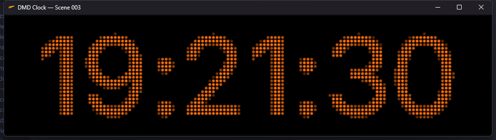
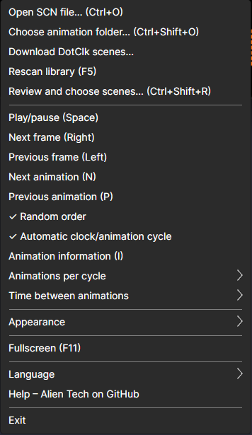
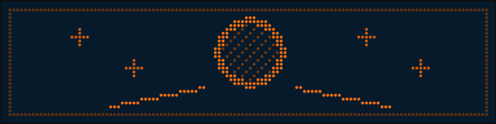
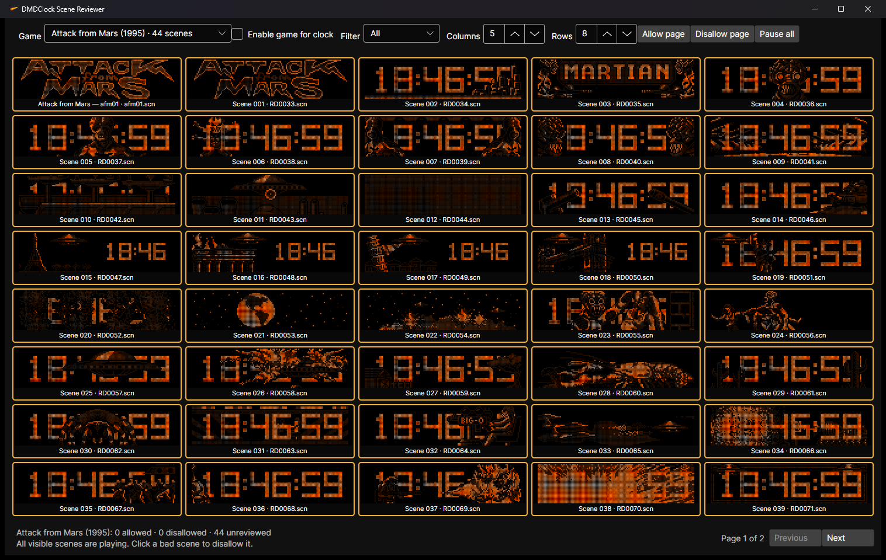
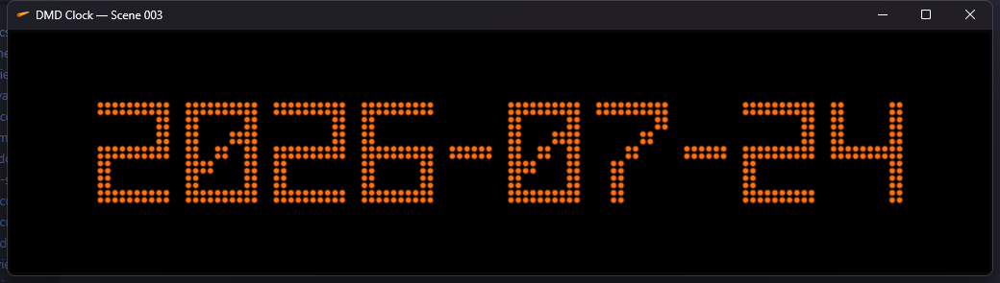

# DMDClock user setup

This guide is for someone who only wants the clock and DotClk scenes to work on a
Windows computer. You do not need Git, Visual Studio, PowerShell, or the .NET SDK.

## What you need

- Windows 10 or Windows 11 x64
- `DMDClock-win-x64-setup.exe` (recommended) or
  `DMDClock-win-x64-standalone.zip`
- your own DotClk `.scn` animation files if you want animations

Animations are not included with DMDClock.

## 1. Install DMDClock

### Recommended: setup EXE

1. Download `DMDClock-win-x64-setup.exe` from the project's
   [GitHub Releases page](https://github.com/DrWize/DMDClock-Windows-x64/releases).
2. Run the setup EXE.
3. Keep the default per-user installation directory unless you have a reason to
   change it.
4. Choose optional Desktop, automatic-start, and screensaver tasks.
5. Start DMDClock from the Start Menu.

The installer adds both `DmdClock.App.exe` and `DMDClock.scr`. It does not require
administrator rights or an installed .NET runtime.

### Alternative: standalone ZIP

1. Download `DMDClock-win-x64-standalone.zip` from the project's
   [GitHub Releases page](https://github.com/DrWize/DMDClock-Windows-x64/releases).
2. Right-click the ZIP, choose **Properties**, and select **Unblock** if Windows
   shows that option.
3. Choose **Extract All**.
4. Extract it to a permanent folder such as:

```text
C:\Users\<your-name>\Apps\DMDClock\
```

Do not run the program from inside the ZIP. Keep the whole extracted folder. The
`i18n` directory contains the menu text, and `DMDClock.scr` is the screensaver.

## 2. Start the clock

Double-click `DmdClock.App.exe`. After the short startup message, the clock appears:



Right-click anywhere on the display to open the menu:



Useful first choices:

1. Open **Appearance → Clock → Font** and select a clock face.
2. Open **Appearance → Color theme** and select a color.
3. Open **Appearance → Clock → Time format** for 12- or 24-hour time.
4. Toggle **Appearance → Clock → Show seconds** if wanted.
5. Press `F11` for fullscreen.

Your choices are saved automatically.

## 3. Add scenes

You can keep scenes anywhere on the computer.

### Where to get scene files

The easiest method is built into DMDClock:

1. Start DMDClock and right-click the display.
2. Choose **Download DotClk scenes…**.
3. Review the source shown in the download window and select **Download**.
4. Wait for the download and scan to finish. DMDClock selects the new library
   automatically and starts the first valid scene.

The app downloads the original collection from sigmafx and installs only its
`.scn` files under:

```text
%LOCALAPPDATA%\DmdClock\Scenes\DotClk\
```

Downloads are limited in size, ZIP paths are checked before extraction, and the
existing downloaded pack is replaced only after a complete new pack is ready.
Scenes remain outside the EXE and SCR.

You can also [browse the original DotClk Scenes directory](https://github.com/sigmafx/DotClk-Resources/tree/master/Scenes).
The installer provides the same source link from the Start Menu and its final page.
DMDClock does not own the animation collection; review the source repository's
terms before redistributing the files.

### Use an existing scene folder

1. Press `Ctrl+Shift+O`.
2. Select the folder containing your `.scn` files.
3. DMDClock scans that folder and all its subfolders.

### Keep scenes beside DMDClock

Create this directory inside the extracted DMDClock folder:

```text
scenes\
```

Copy the `.scn` files into it, then start DMDClock or press `F5`.

When a scene is playing, the DMD displays its original four-bit frames. This
project-created synthetic frame shows the result without redistributing a commercial
pinball animation:



If one file is damaged, DMDClock rejects that file and continues using the valid
scenes. Press `N` for the next animation and `P` for the previous animation.

## 4. Review and choose scenes

Press `Ctrl+Shift+R` or choose **Review and choose scenes…** from the right-click
menu. The reviewer plays every visible scene at the same time, using the same DMD
renderer and working clock as normal playback.



Choose a game, set the number of columns and rows, and click tiles to allow or
disallow scenes. Green scenes are Allowed, red scenes are Disallowed, and amber
scenes are Unreviewed. Enable the game with **Enable game for clock**. Only Allowed
scenes from enabled games play in either the normal application or screensaver.

Decisions are saved immediately and shared by both modes. The default layout is
5 columns by 8 rows (40 live scenes), and games with more scenes use additional
pages.

## 5. Make the clock and scenes alternate

Open the right-click menu and:

1. enable **Automatic clock/animation cycle**;
2. choose **Random order** if you do not want filename order;
3. choose **Animations per cycle**;
4. choose **Time between animations**;
5. open **Appearance → Clock → Clock duration** and choose how long the clock stays visible;
6. press `T` to return to the clock and begin the cycle.

The application will show the clock, play the selected number of animations, and
return to the clock automatically.

## 6. Show the date

Press `D` to show the date:



Choose its appearance under:

- **Appearance → Date → Date format**
- **Appearance → Date → Font**

Press `T` to return to the clock.

## 7. Install or activate the screensaver

If **Make DMDClock the active Windows screensaver** was selected in Setup, open
Windows Screen Saver Settings and choose the wait time.

For a ZIP installation or manual reinstallation:

1. Close DMDClock.
2. Right-click `DMDClock.scr`.
3. Choose **Install**.
4. Select DMDClock in Windows Screen Saver Settings.
5. Choose a Windows wait time and click **Preview**.

The screensaver uses the same scene folder and settings as the normal application.
Do not move or delete the extracted DMDClock folder after installing it. If you move
the folder, install `DMDClock.scr` again from its new location.

## Everyday controls

| Key | Action |
| --- | --- |
| `T` | Show the clock |
| `D` | Show the date |
| `Space` | Pause or resume |
| `N` / `P` | Next / previous animation |
| `Left` / `Right` | Previous / next animation frame |
| `I` | Show or hide animation information |
| `F5` | Rescan the scene folder |
| `F11` | Enter or leave fullscreen |
| `+` / `-` | Increase or decrease the display size |
| `0` | Reset display size to 100% |
| `Escape` | Leave fullscreen or close the menu |

## Where settings and logs are stored

DMDClock stores writable files in:

```text
%LOCALAPPDATA%\DmdClock\
```

- `settings.json` contains your settings.
- `library-index.json` contains the scene index.
- `library-selections.json` contains enabled games and scene review decisions.
- `logs\dmdclock.log` explains scan and playback problems.

This means upgrading the application normally does not remove your preferences.

## Quick fixes

- **The EXE asks for DLL files:** use the standalone ZIP, or re-extract every file
  from the regular portable ZIP.
- **The menu shows names such as `showClock`:** restore the complete `i18n` folder
  beside the EXE.
- **No animations appear:** select the correct folder with `Ctrl+Shift+O`, press
  `F5`, then use `Ctrl+Shift+R` to enable a game and allow scenes. Check
  `dmdclock.log` if the files still do not appear.
- **The display is blank:** press `T`, set brightness to 100%, and choose
  **Appearance → Color theme → Classic orange**.
- **The screensaver no longer starts:** install `DMDClock.scr` again from its
  current permanent folder.
- **You want to reset everything:** close DMDClock, back up the AppData directory,
  and remove `settings.json`.

For explanations of every menu option, see [Settings reference](SETTINGS.md).
